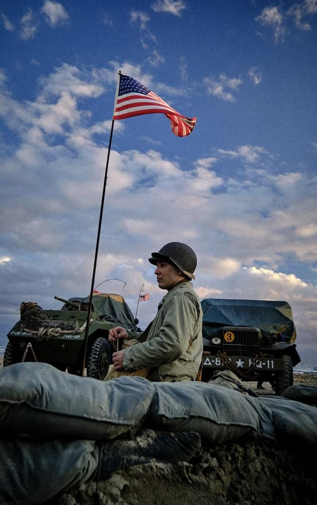
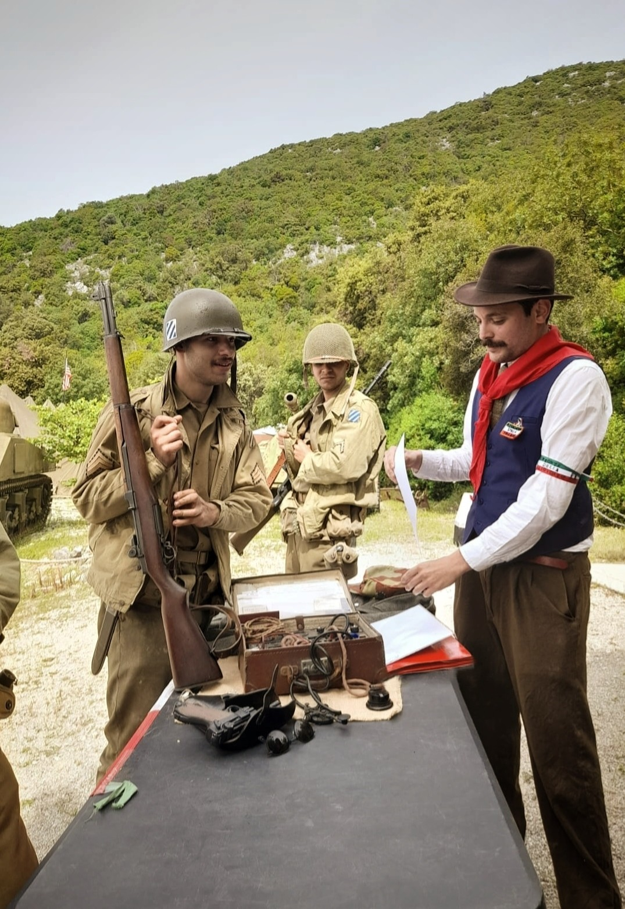
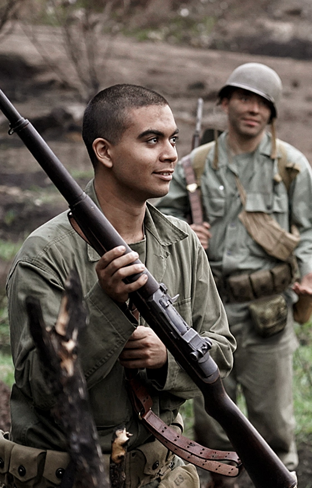

<!DOCTYPE html>
<html lang="it">
<head>
  <meta charset="UTF-8">
  <meta name="viewport" content="width=device-width, initial-scale=1.0">
  <title>States Boys Reenactment Group</title>
  
</head>
<body>

  

    Benvenuti sul nostro sito!
  

  

    Sito in manutenzione
  

  

    La cultura storica è una delle risorse più importanti che abbiamo, e divulgarla è un mestiere nobile da perseverare. Riteniamo che la rievocazione storica sia uno degli strumenti più efficaci per ripercorrere il nostro passato, data la sua natura interattiva ed immersiva. Noi dello States Boys Reenactment Group puntiamo non solo a dare il massimo per l'esperienza degli spettatori, ma anche a rendere accessibile a tutti la pratica della rievocazione.
  

  

    
    
    
  

  

    Chi Siamo:
  

  

    Il nostro gruppo nasce dalla convinzione che la memoria storica sia un bene comune e una responsabilità collettiva, ed è nostro dovere rendere l'esperienza rievocativa facilmente accessibile a tutti. Il gruppo è aperto alla partecipazione di volontari, i quali verranno formati e seguiti gratuitamente dal direttivo dello States Boys RG. Non applichiamo alcuna discriminante di età, sesso o etnia e non esigiamo titoli o esperienze pregresse purché si mantenga un approccio storico-scientifico corretto. Portiamo avanti il nostro lavoro basandoci su ricerche approfondite, studio di fonti primarie come reperti o documenti dell'epoca e coinvolgimento di accademici.  

    Lo States Boys Reenactment Group è attivo in tutta Italia, ricreando scenari storici curati fin nel dettaglio utilizzando reperti originali e riproduzioni estremamente fedeli. Collaboriamo con associazioni, musei, comuni, scuole e anche privati. Ogni informazione scoperta è per noi un patrimonio comune, e verrà condiviso dettagliatamente sia durante eventi pubblici che sulle varie pagine social.  

    Svolgiamo eventi di ogni genere, dagli eventi più statici ed espositivi fino ai Full Immersion, in cui si simulano combattimenti con armi a salve, si dorme in trincea, si mangiano le razioni militari e si impara a cavarsela nella natura con quello che ha da offrire. Premiamo chi si impegna. Partecipare, approfondire, aiutare gli altri, migliorare il proprio kit: tutto questo viene riconosciuto attraverso regali, attestati e decorazioni simboliche.  

    Ricordare il passato è essenziale per imparare dai nostri errori. Proprio in virtù del nostro approccio accademico alla rievocazione, non possiamo evitare di assumere un approccio antifascista e pacifista. Rievocare guerre passate non significa elogiare il conflitto, ma comprenderne le dinamiche e trarne insegnamento.
  

  <!-- Pulsante per la sezione volontari -->
  

    <a href="volontari.html" 
       style="font-family: 'Playfair Display', 'Georgia', serif;
              font-size: 2em;
              background-color: #2d2a29;
              color: white;
              padding: 15px 30px;
              border-radius: 12px;
              text-decoration: none;
              box-shadow: 0 4px 10px rgba(0,0,0,0.3);
              transition: background-color 0.3s ease;">
       Proporsi volontari
    </a>
  

</body>
</html>
